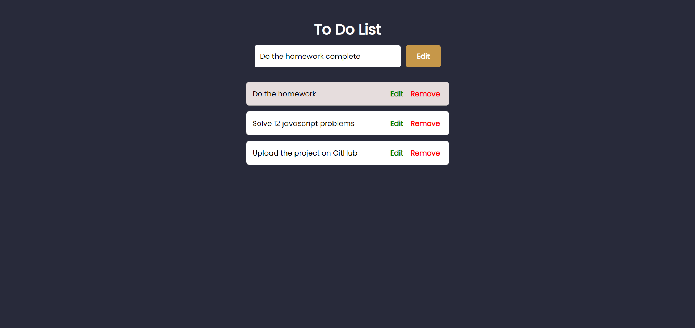
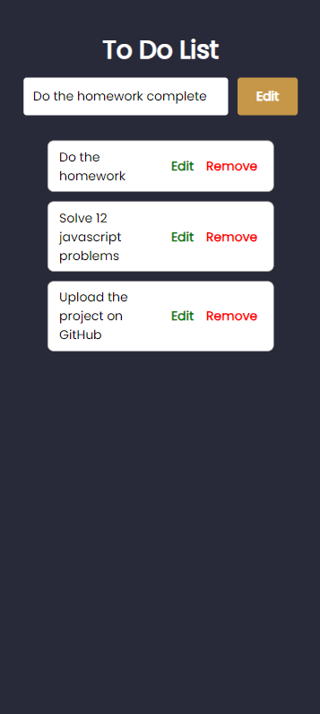

# To-Do List
This is a basic To-Do list application that simply save the users data in local storage of the browser and show them in the UI list.

## Language Used :-

> HTML

> CSS

>Javascript

## Features :-

> Add a new task

> Delete a task

> Edit a saved task

## Desktop View :-

## Mobile View :-
